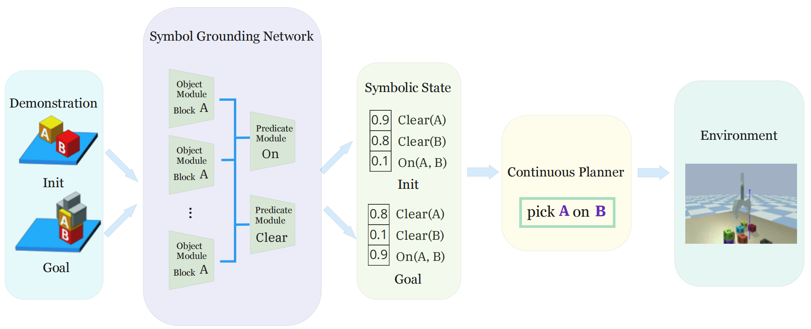

# Towards a Unified Probabilistic PDDL Solver in the Block Stacking Domain

This is the repository for PKU CoRe 2023 Fall Course Project: Probabilistic PDDL Solver (Track of Abstract Reasoning).




## Installation
First clone this repo:
```
git clone https://github.com/Intellouis/Probabilistic-PDDL-Solver
```
After creating a virtual (conda) environment, please install the requirements and prerequisites:
```
pip install -r requirements.txt
```

## Environment

Following [NTP Vat Release](https://github.com/StanfordVL/NTP-vat-release/tree/master), we implement a lightweight environment of block stacking.

### Environment Introduction and Details
- Object space: We have 8 blocks, numbered 1 to 8. These blocks are totally same except for numbers.
- State space: We provide two versions of state description - both the precise locations of blocks (the coordinate space) and the PDDL-language descriptions. These coordinate-based state representations form the observation space of SGN, while those language-based descriptions form the observation space of LLM-based agents. We also provide the ground truth embeddings of each state during interactions and rollouts, which are used to determine whether a task is finished (whether the goal is reached).
- Embedding space: We use a 64-dimensional vector to represent a state, as details can be figured out in our paper.
- Action space: We use "put $i$ on $j$" to represent an action, where $i \in [1, 2, ..., 8]$ is the source block, and $j \in [1, 2, ..., 8]$ is the target place. In the domain of block stacking, we only allow agents placing a block right on the top of another block. This representation is consistent with the "grasp" and "place" in [Continuous Relaxation of Symbolic Planner for One-Shot Imitation Learning](https://arxiv.org/abs/1908.06769).
- Goal space: We also use a 64-dimensional vector to represent the goal state, in which 8 elements are 1 exactly. In each step of a trajectory, the goal vector is used to determine whether the goal has been reached (whether the task is finished).
- Tasks: We provide 2000 different tasks, which are obtained from [Neural Task Programming: Learning to Generalize Across Hierarchical Tasks](https://arxiv.org/abs/1710.01813). Each task has a unique goal, forming a diverse set of test cases.

### Datasets and Tasks
All the datasets (sampled from our environment using an expert policy) are listed in ```/dataset/```. 


## PDDL Solvers

We implement both the SGN-based PDDL Solver and the LLM-agent (baseline). The LLM-agent is based on ```GPT-4-11.6-preview```.

our trained checkpoints are listed in ```/model/```.

### Run Experiments

To train SGN, run:
```
python train_SGN.py
```
To make inference / test on downstream tasks, run:
```
python main.py --continuous 1 --clip 0
```
To take the ablation study, in which a clip function is added during the inference process, run:
```
python main.py --continuous 1 --clip 1
```
To sample data from the environment using expert policy, run:
```
python main.py --continuous 0
```
To utilize large language models for tackling the challenges in block stacking tasks, run:
```
python llm_agent.py
```

### Experimental Results

|       | SGN (w/o clip) | SGN (w/ clip) | MLP (w/o clip) | MLP (w/ clip) | LLM-agent |
|:-----:|:--------------:|:-------------:|:--------------:|:-------------:|:---------:|
| Success Rate | 86.5% | 76.9% | 56.2% | 36.4% | 52.5% |


